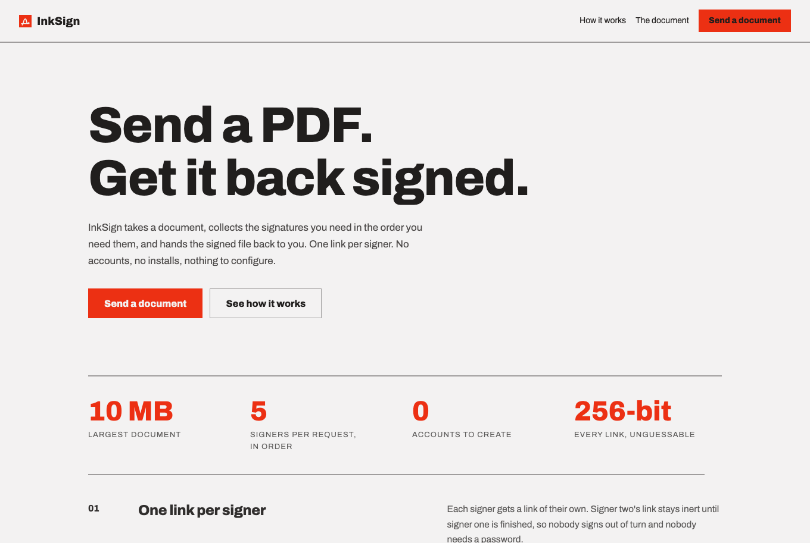
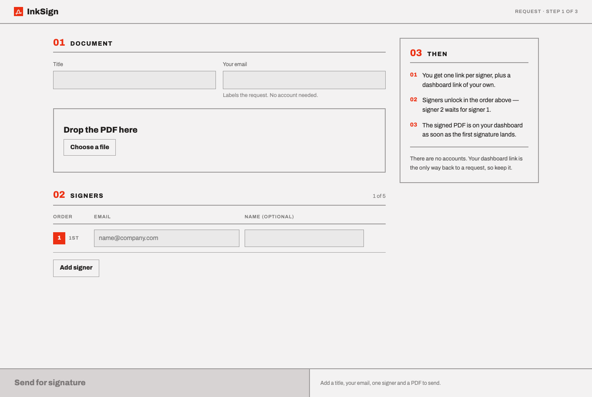
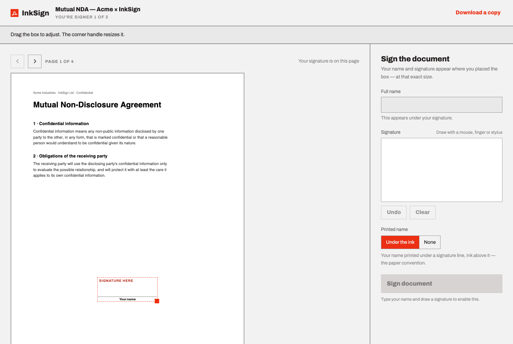
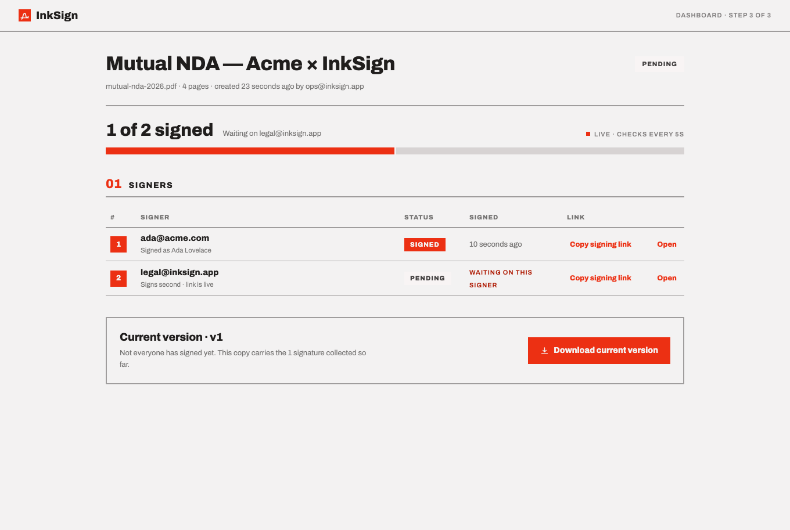

# InkSign

Upload a PDF, send it out for signature, get the signed copy back.

[](https://github.com/Aethereux/InkSign/actions/workflows/ci.yml)

**Live: <https://inksign.onrender.com>** — free tier, so the first request after 15 minutes
idle can take a minute to wake.

---

## What it does

A requester uploads a PDF and lists signers in order. They get one unguessable link per
signer plus a dashboard link of their own. Signers open their link, click where the
signature goes, draw it, and submit. The signed PDF appears on the dashboard as soon as the
first signature lands.

No accounts — the links are the access control.

Extras beyond the core flow: **sequential multi-signer** (signer 2's link is inert until
signer 1 signs), **click-to-place positioning with as many marks as you like** — initial every
page and sign the last one, in a single submission — and **live status tracking**.

| | |
|---|---|
| **Landing** |  |
| **Create a request** |  |
| **Sign it** |  |
| **Collect it** |  |

---

## Run it locally

Bun is the only prerequisite — no Node, no npm.

```bash
git clone https://github.com/Aethereux/InkSign.git
cd InkSign
bun install

docker run -d --name inksign-pg -p 5432:5432 -e POSTGRES_PASSWORD=dev postgres:17

cp .env.example .env    # defaults match the container above
bun run dev             # http://localhost:3000
```

The schema is created on boot — no migration step. For hot reload while working on the
frontend, run `bun run dev:web` alongside it (port 5173, proxies `/api` to 3000).

Routes: `/` landing · `/new` create · `/d/:requesterToken` dashboard · `/s/:signToken` sign.

Built on Bun 1.3.14 and Postgres 17 — the same major version Neon and CI run, so there's one
version in play everywhere. The suite also passes on 16 and 18.

## Tests

```bash
bun run test        # builds the frontend, then runs the suite
bun run typecheck
```

77 tests covering the placement maths, the upload trust boundary (11 rejection cases, each
asserting nothing was written), the full two-signer flow, out-of-turn and double-signing
refusals, opaque 404s on every token route, multi-page placement, names outside WinAnsi that
would otherwise crash the stamp, and a concurrency test that fires three simultaneous
signatures at one link and asserts exactly one wins.

They run against real Postgres, not a stub — the schema and the signing transaction are
exactly what a stub can't exercise. Since they truncate every table, they redirect
themselves to a scratch `<name>_test` database (`src/test-setup.ts`), so your dev data
survives. CI runs the same commands on every push against a `postgres:17` service container.

---

## Architecture

One Bun process serves the API *and* the built frontend — one container, one port, one URL,
no CORS. Elysia for routing, Vite + React + TypeScript on the front.

```
src/
  app.ts        Elysia routes, exported without .listen() so tests use app.handle()
  index.ts      reads PORT + DATABASE_URL, migrates, listens
  db.ts         Bun.sql connection, schema bootstrap, token generation
  geometry.ts   placement maths — shared by the stamp and the preview
  sign.ts       pdf-lib stamping
  validate.ts   the upload trust boundary
web/
  screens/      Create, Dashboard, Signer
  components/   PdfPage, SignaturePad, shared chrome
```

Three decisions worth defending:

**Tokenised links, not accounts.** Each document mints a 256-bit requester token and one per
signer. Unknown, wrong-type and non-existent tokens all return an identical opaque 404, so
the space can't be probed. A signer's payload never leaks another signer's token — there's a
test for that.

**Incremental multi-signer, no merge step.** Each signature stamps the current working PDF
and stores the result as the next version, so the final artifact is just the last version.
That collapses the hard part of multi-signer into one already-tested function and gives
version history free. The read-check-write runs in one transaction with `SELECT … FOR
UPDATE` on both rows; without it, two concurrent signers read the same version and one
signature silently overwrites the other.

**One geometry module for stamp and preview.** `src/geometry.ts` has no dependencies, so the
browser can import it without bundling a PDF writer. The preview scales its constants by
`renderedWidthPx / pageWidthPt`; the box-height *fraction* needs no scale because it cancels.
Two separate copies of those numbers would have placed signatures correctly on desktop and
visibly wrong on mobile, where the scale is ~0.6.

PDFs live in Postgres as `bytea` rather than on disk: every free host has an ephemeral
filesystem, and a document uploaded on Monday has to still be there on Tuesday.

---

## How this was built

With AI tooling, as the brief encourages, in three passes.

1. **Planning** produced [`docs/DESIGN-HANDOFF.md`](docs/DESIGN-HANDOFF.md) — data model,
   API contract, security model and test plan, written before any code.
2. **Claude Design** turned that into the visual and interaction spec in
   [`docs/DESIGN-BUNDLE.md`](docs/DESIGN-BUNDLE.md), plus the prototypes in `docs/design/`.
3. **Claude Code** implemented against both, committed feature by feature.

Where the documents disagreed the design won, and each disagreement is recorded in its
Deviations section rather than quietly resolved — most notably the audit trail, cut because
it logged signer IPs and user agents.

Every file has been read and reviewed by hand. Things that review caught: the signer's PDF
fetch was swallowing failures and leaving a blank frame; the placement geometry lived in two
places and would have drifted; and the test suite was truncating the dev database on every run.

## Deployment

Render (Docker, free) + Neon (Postgres, free). Both permanent free tiers, no card needed.

1. Create a Neon project, copy the **direct** connection string — not the `-pooler` one.
   `Bun.sql` uses prepared statements, which PgBouncer's transaction pooling rejects.
2. Render → New Web Service → this repo → Docker → Free, region matching Neon's.
3. Set `DATABASE_URL`, and the health check path to `/health`. Render supplies `PORT`.

A `GET /health` endpoint exists so an uptime pinger can keep the instance warm.

---

## Deliberately not built

Each of these was a decision, not an oversight.

| Not built | Why |
|---|---|
| Email notifications | Needs an API key and verified sender domain. Links plus the dashboard already satisfy "return the signed document", with nothing to expire mid-review |
| Accounts and login | Days of work for a demo an unguessable link already secures |
| Audit trail | Cut in design: it logged signer IPs and user agents, and the privacy cost outweighed the feature. `signers.signed_at` is what the dashboard shows |
| Webhooks | No consumer exists |
| Document expiry | A column and a scheduled job for a demo nobody will leave running |
| Parallel signing | Sequential is the common case and half the state machine |
| Rate limiting | Single-tenant demo; a real deployment would want it |

## Known limitations

- **A visual signature with a timestamp, not cryptographic e-signature PKI.** The PDF isn't
  digitally signed and carries no certificate. It records who typed what name and when; it
  does not prove identity.
- No rate limiting — the upload endpoint is open to anyone with the URL.
- Each signature stores a full copy of the PDF: ~60 MB for a 10 MB document with five
  signers. Fits Neon's free 0.5 GB for a demo, would need pruning in earnest.
- Page rotation handled for 90° multiples only; arbitrary rotations would skew placement.
- Free hosting sleeps, so the first request after idle is slow.
